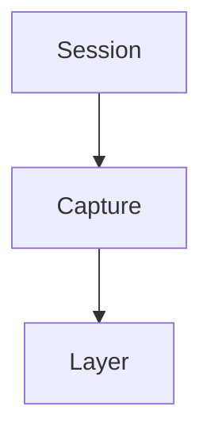

# Waymark design notes

This page contains a mermaid diagram of the capture flow.

```mermaid
graph TD
  A[Session] --> B[Capture]
  B --> C[Layer]
```

See the [decisions](../../decisions.md) file and gotcha G-0001.
